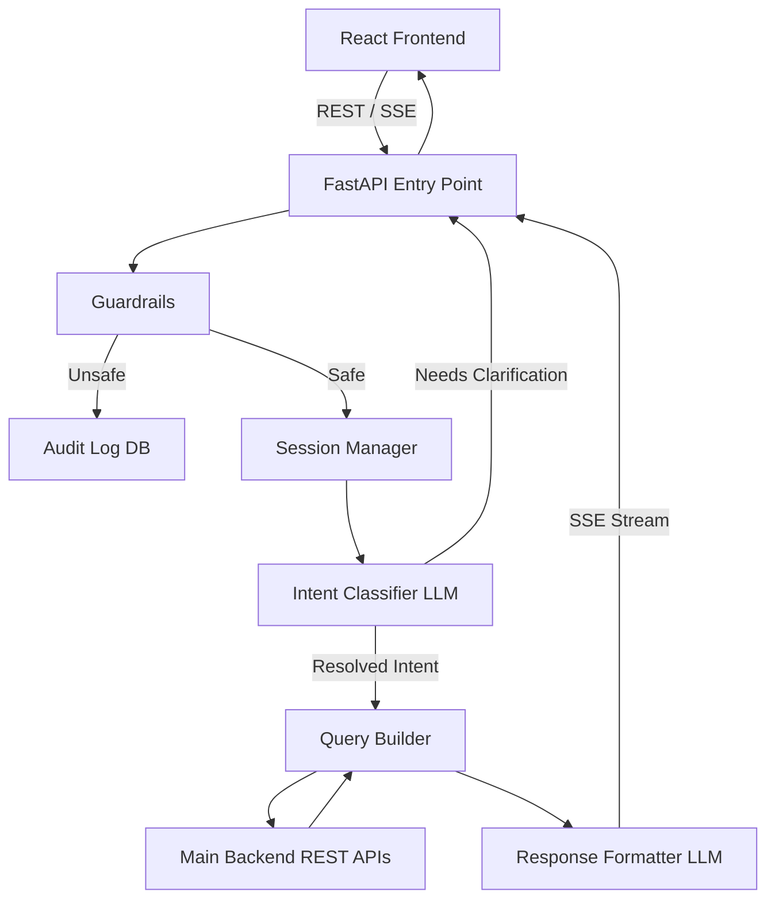
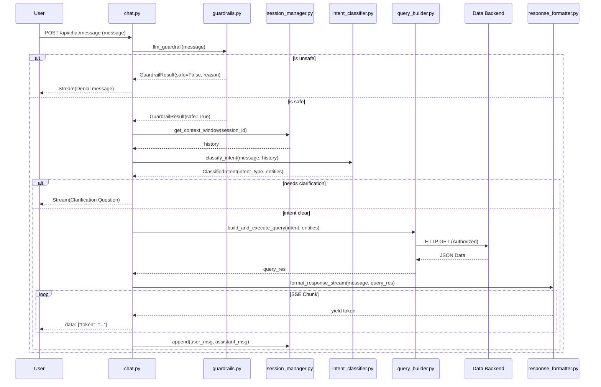

# Relanto Chatbot Microservice

The Relanto Chatbot Microservice is a robust, AI-powered conversational backend built with FastAPI. It provides natural language search, intelligent intent classification, and strict security guardrails tailored specifically for B2B Sales Intelligence.

## 🚀 What It Does Internally

When a user submits a natural language query, the microservice orchestrates a highly structured pipeline to ensure accurate, safe, and context-aware responses without direct database exposure.

### Internal Workflow

1. **Security Guardrails (First Line of Defense)**
   - **Static Checks (`fast_guardrail`)**: Scans input for SQL injection attempts or explicitly blocked phrases.
   - **LLM Safety Guardrail (`llm_guardrail`)**: Uses an LLM to classify if the query is a safe business read, analytics request, or out-of-bounds (e.g., system mutations, prompt injections). Logs unsafe intents to an audit table.

2. **Context Retrieval (`Session Manager`)**
   - Retrieves the last 6 turns of conversational history to maintain state context.

3. **Intent Classification (`classify_intent`)**
   - Uses Groq or OpenAI LLMs to analyze the message and history.
   - Outputs a structured JSON defining the `intent_type` (e.g., `get_contacts`, `get_company`), specific `entities`, and `filters`.
   - Optionally flags if clarification is needed from the user.

4. **Query Execution (`query_builder`)**
   - Maps the classified intent to internal Backend REST API endpoints.
   - Securely forwards the user's authorization token to enforce RBAC rules at the main data layer.

5. **Response Formatting (`response_formatter`)**
   - Combines the raw data fetched from the API with the original query context.
   - Streams the generated response back to the client using Server-Sent Events (SSE).
   - Embeds contextual "suggested actions" (e.g., "Best outreach time?") based on the conversation flow.

---

## 🏗️ High-Level Design (HLD)

---

## 🧩 Low-Level Design (LLD)

## 📂 Directory Structure

- `main.py`: Application entry point and server configuration.
- `routers/`: Contains `chat.py` defining the API endpoints.
- `services/`: Core logic modules.
  - `guardrails.py`: Security and policy compliance checks.
  - `session_manager.py`: User chat history handling.
  - `intent_classifier.py`: LLM prompting for intent extraction.
  - `query_builder.py`: Mapping intents to data backend calls.
  - `response_formatter.py`: Generating natural language replies from JSON data.
- `models/`: Pydantic schemas (`schemas.py`) for API input/output validation.
- `prompts/`: Text files containing the raw LLM prompt templates (`intent_prompt.txt`, etc.).
