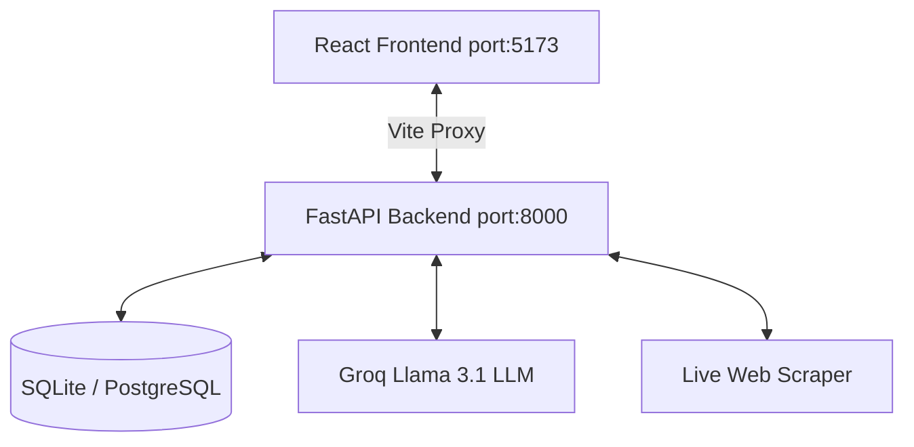

# Relanto Sales Intelligence — Frontend Dashboard

> AI-powered enterprise sales intelligence platform. Dark, data-dense, and built for daily use by salespeople and BDEs.

---

## 🚀 How to Run

### Prerequisites

| Tool | Version |
|---|---|
| Node.js | v18+ |
| npm | v9+ |
| Python | 3.10+ (for backend) |

### 1. Start the Backend

The frontend requires the FastAPI backend to be running to fetch live data.

```bash
cd backend
python -m venv venv
venv\Scripts\activate   # or source venv/bin/activate on Mac/Linux
pip install -r requirements.txt

# Start the server
uvicorn app.main:app --reload --port 8000
```

### 2. Start the Frontend

```bash
cd frontend
npm install
npm run dev
```

Opens at **`http://localhost:5173`**

> The Vite dev server proxies all `/api/*` requests to `http://localhost:8000`.

### 3. Seed the Database

If your charts are empty, it means your SQLite database has no data. You can seed it with 50 target companies and sample triggers by running:

```bash
curl -X POST http://localhost:8000/api/seed
```
*(Or use PowerShell `Invoke-RestMethod -Method Post -Uri http://localhost:8000/api/seed`)*

---

## 📁 Project Structure

```
frontend/
├── index.html                      # HTML entry point (meta, SEO tags)
├── vite.config.js                  # Vite + Tailwind v4 plugin + API proxy
├── package.json
│
└── src/
    ├── main.jsx                    # React 18 createRoot + BrowserRouter
    ├── App.jsx                     # Route definitions + layout shell
    ├── index.css                   # Global styles, Tailwind v4 @theme, animations
    │
    ├── hooks/
    │   └── useApiData.js           # Custom hook for fetching from FastAPI backend
    │
    ├── services/
    │   ├── api.js                  # Axios/fetch wrappers for /api endpoints
    │   └── transform.js            # Transforms snake_case backend data to camelCase UI data
    │
    ├── components/
    │   ├── ui/                     # Reusable atomic components (Badge, ScoreRing, etc.)
    │   └── layout/                 # Page-level structural components (Header, Sidebar)
    │
    └── pages/                      # One file per route
        ├── Dashboard.jsx           # /dashboard — Intelligence feed (home)
        ├── Companies.jsx           # /companies — Account hub
        ├── Triggers.jsx            # /triggers — Trigger explorer
        ├── OutreachBrief.jsx       # /outreach/:triggerId — Brief document
        └── Analytics.jsx           # /analytics — Charts + KPIs dynamically generated from live data
```

---

## 🏗️ Architecture & Data Flow



### Pages & Responsibilities

| Page | Route | Primary Responsibility |
|---|---|---|
| **Dashboard** | `/dashboard` | Daily intelligence feed, filtered trigger cards, priority account panel |
| **Companies** | `/companies` | Account management table, detail panel, trigger history timeline |
| **Triggers** | `/triggers` | Full trigger exploration, multi-select filters, stats summary, sortable card grid |
| **Outreach Brief** | `/outreach/:id` | Full brief document — business context, opportunity analysis |
| **Analytics** | `/analytics` | Charts (area, donut, bar), KPI stat cards, score distribution — **100% dynamically calculated from live SQLite data** |

---

## 🚧 Roadmap & "Coming in v2"

The UI contains the structural skeleton for advanced ML features that are planned for **v2** of the backend. Currently, these sections in the UI have a **"Coming in v2" overlay** to explicitly show that the backend service is not yet connected:

1. **Outreach Engine:** Generative AI for drafting personalized email narratives, subject lines, and talking points.
2. **Timing Engine:** Heatmaps and optimal outreach window calculations.

All other features (Live Scraper, Event Detection, Opportunity Scoring, Account Analytics) are fully functional and powered by the live backend.

---

## 📦 Scripts

| Command | Description |
|---|---|
| `npm run dev` | Start dev server at `localhost:5173` |
| `npm run build` | Production build to `dist/` |
| `npm run preview` | Preview production build locally |
| `npm run lint` | ESLint check |
